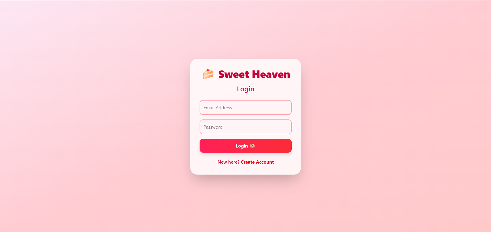
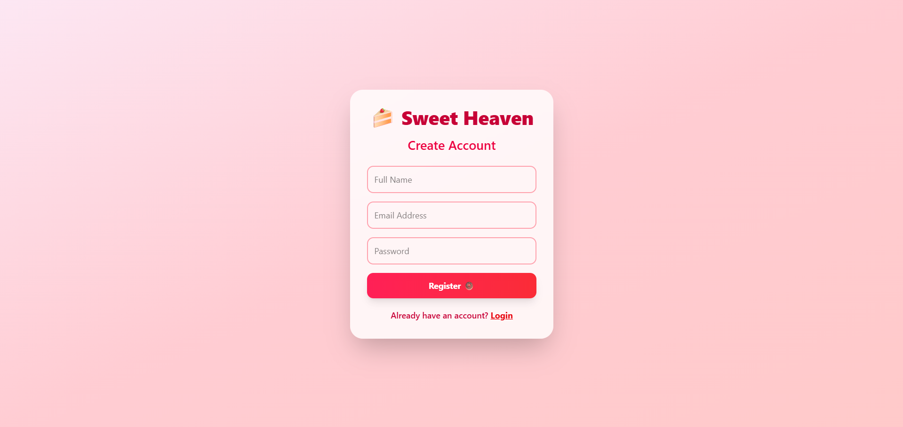
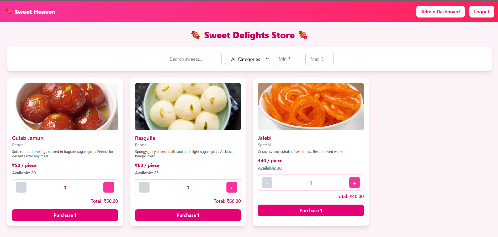
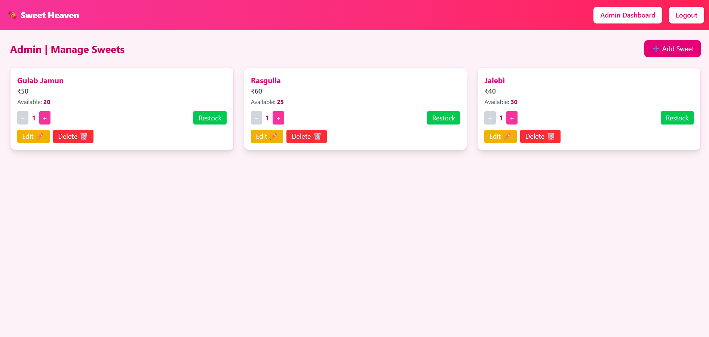
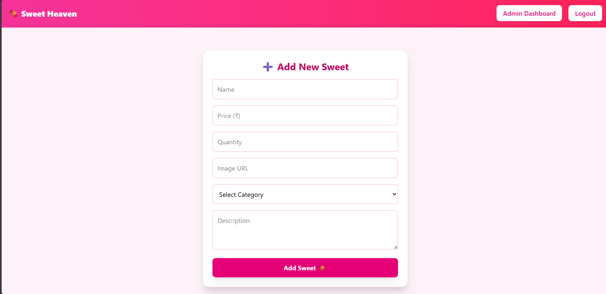

# Sweet Shop Management System

This document provides comprehensive documentation for the **Sweet Shop Management System**, a full-stack application built to manage inventory and facilitate customer purchasing for a sweet shop.

-----

## 1\. Overview and Technology Stack

The application follows a modular structure, split into a **Server** (backend) and a **Client** (frontend).

| Component | Technology Stack | Key Libraries/Frameworks |
| :--- | :--- | :--- |
| **Server (Backend)** | Node.js | **Express** (Routing), **Mongoose** (MongoDB ODM), **bcryptjs** (Password Hashing), **jsonwebtoken** (JWT Auth)|
| **Client (Frontend)** | React | **Vite** (Build Tool), **Tailwind CSS** (Styling), **axios** (API Calls), **react-router-dom** (Routing)|

### Core Functionality

  * **Authentication & Authorization:** Users can register and log in. Access to certain routes is restricted based on the user's role: **regular users** or **admins** (who have the `isAdmin: true` flag in the database).
  * **Sweet Management (Admin):** Admins can **Create, Read, Update, and Delete (CRUD)** sweet items and manage inventory via **restock** actions.
  * **Customer Interaction (User):** Customers can view available sweets, **search/filter** them, and **purchase** them.

-----

## 2\. Detailed Folder Structure

```
/
├── client/                     # Frontend (React/Vite)
│   ├── src/
│   │   ├── api/
│   │   │   └── api.jsx         # Centralized Axios instance with JWT interceptor
│   │   ├── components/
│   │   │   └── ...             # Reusable UI and page components (AuthPage, SweetCard, etc.)
│   │   └── App.jsx             # Main routing component
│   └── package.json            # Frontend dependencies and scripts
└── server/                     # Backend (Node/Express)
    ├── config/
    │   └── db.js               # MongoDB connection logic
    ├── controllers/
    │   └── ...                 # Business logic for API endpoints (auth, sweet, inventory)
    ├── middleware/
    │   └── authMiddleware.js   # JWT verification (`auth`) and role checking (`isAdmin`)
    ├── models/
    │   ├── sweet.model.js      # Mongoose schema for sweet items
    │   └── user.model.js       # Mongoose schema for users
    ├── routes/
    │   └── ...                 # Express routers (auth, sweet, inventory)
    ├── tests/
    │   └── ...                 # Jest test files
    ├── app.js                  # Express setup (middleware, route mounting)
    ├── index.js                # Server entry point
    └── package.json            # Backend dependencies and scripts
```

-----

## 3\. Local Setup Instructions

### Prerequisites

  * Node.js (LTS version recommended)
  * MongoDB instance (local or remote URI)

### Backend Setup

1.  Navigate to the server directory: `cd server`
2.  Install dependencies: `npm install`
3.  Create a **`.env`** file in the `/server` directory:
    ```
    MONGO_URI=your_mongodb_connection_string_here
    JWT_SECRET=your_strong_secret_key_here
    ```
4.  Start the backend server: `node index.js`
      * The server will run on **port 5000** and connect to your MongoDB.

### Frontend Setup

1.  Navigate to the client directory: `cd client`
2.  Install dependencies: `npm install`
3.  Start the development server: `npm run dev`
      * The client is configured to connect to the backend API at `http://localhost:5000/api`.

-----

## 4\. Backend Testing

The backend includes a comprehensive test suite using **Jest** and **Supertest**, leveraging `mongodb-memory-server` for isolated testing.

  * **Test Command:** Run from the `/server` directory: `npm test` or `jest --runInBand`.
  * **Tested Modules:**
      * **Auth:** Tests user registration (preventing duplicates) and login with valid/invalid credentials.
      * **Sweets (CRUD/Search):** Validates that CRUD operations are restricted to **admin users** and confirms search functionality (e.g., partial name match).
      * **Inventory (Purchase/Restock):** Confirms that **purchase** works for regular users with sufficient stock, and that **restock** is restricted to **admin users**.

-----

## 5\. API Endpoints and Core Logic

All API routes are prefixed with `/api` and require **JWT authentication** using a Bearer token.

### A. Authentication (`/api/auth`)

| Endpoint | Method | Role | Logic |
| :--- | :--- | :--- | :--- |
| `/register` | POST | Public | Hashes password with `bcryptjs` before saving; prevents duplicate emails. |
| `/login` | POST | Public | Compares password with `bcrypt.compare` and issues a **JWT** upon success. |

### B. Sweet CRUD & Search (`/api/sweets`)

| Endpoint | Method | Role | Logic |
| :--- | :--- | :--- | :--- |
| `/` | POST | **Admin** | Adds a new sweet (requires `auth` and `isAdmin` middleware). |
| `/` | GET | Authenticated | Fetches all sweets. |
| `/search` | GET | Authenticated | Filters by `name` (case-insensitive regex), `category`, `minPrice` (`$gte`), and `maxPrice` (`$lte`). |
| `/:id` | PUT | **Admin** | Updates an existing sweet. |
| `/:id` | DELETE | **Admin** | Deletes a sweet record. |

### C. Inventory Management (`/api/sweets`)

| Endpoint | Method | Role | Logic |
| :--- | :--- | :--- | :--- |
| `/:id/purchase` | POST | Authenticated | Decrements `quantity`. Returns **400** if `amount` is invalid or stock is insufficient ("Not enough stock available"). |
| `/:id/restock` | POST | **Admin** | Increments `quantity`. Returns **400** if `amount` is invalid. |

-----

## 6\. Client-Side Architecture Deep Dive

### A. Authentication and Routing

The client enforces role-based access using components:

  * **`ProtectedRoute`:** Redirects unauthenticated users to `/auth`. If `adminOnly` is true, it redirects non-admin users to `/`.
  * **`GuestRoute`:** Redirects authenticated users away from the `/auth` page to `/`.
  * **API Interceptor (`client/src/api/api.jsx`):** Automatically reads the JWT from `localStorage` and injects it into the `Authorization: Bearer <token>` header for every outgoing API request.

### B. Component Logic Examples

  * **`HomePage` (Filtering):** Uses `useEffect` to trigger the `applyFilters` function whenever `search`, `category`, `minPrice`, or `maxPrice` state changes, ensuring an updated list of sweets is displayed.
  * **`SweetsCard` (Purchase):** Calculates and displays the **Total Price** based on the selected quantity (`qty * sweet.price`). The purchase button is disabled if `currentQuantity <= 0` ("Out of Stock").
  * **`AdminSweetsPage` (Restock UI):** Manages restock amounts per item using a `restockQty` state object. Calls the `POST /sweets/:id/restock` endpoint with the specified amount.

-----
## 7. Screenshots

This section provides visual references for key pages and features in the application interface.

| Screenshot | Description |
| :--- | :--- |
|  | The user login page. |
|  | The user registration page. |
|  | The main customer view showcasing available sweets and filters. |
|  | The administrator's panel for managing inventory (CRUD operations and restock). |
|  | The form used by administrators to add a new sweet item (or update existing ones). |

## 8\. My AI Usage

### AI Tool Used

  * **ChatGPT**

### How I Used the AI Tool

| Component | Usage Description |
| :--- | :--- |
| **Frontend (React)** | I used ChatGPT to generate code snippets and concepts for the React components, handling state management (using `useState` and `useEffect`), implementing UI elements with Tailwind CSS, and setting up the API client (`api.jsx`) with Axios. |
| **Backend Testing (Node/Jest/Supertest)** | I asked ChatGPT to generate the initial **Jest unit tests** for the backend API endpoints, covering authentication (`auth.test.js`), sweet CRUD operations (`sweet.test.js`), and inventory logic (`inventory.test.js`). |

### Reflection on How AI Impacted My Workflow

The use of ChatGPT significantly **accelerated** both the development and testing phases of this project. It allowed me to quickly scaffold the React components and implement styling logic, reducing the time spent on repetitive UI work.

The most notable impact was in **backend testing**. By using the AI to generate boilerplates for the Jest/Supertest files, I was able to rapidly establish a robust test environment. This ensured high confidence in the API's functionality, especially for complex logic like authorization (`isAdmin` checks) and inventory validation (e.g., preventing purchases when stock is low), which were core requirements for the system. Overall, AI served as an efficient coding partner, allowing me to focus more on the application's overall architecture and core business logic rather than boilerplate code generation.
